## **Informe TP 0**

### Paso 0

**a)**

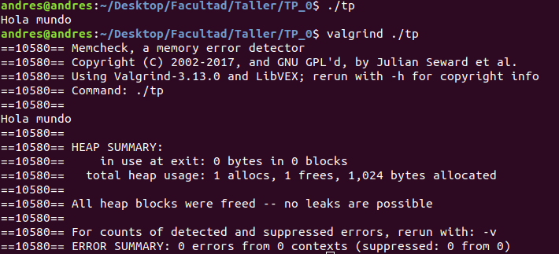

**b)**

Valgrind es una herramienta de verificación de manejo de memoria. Básicamente, su utilidad es la de informar al programador si manejó correctamente la memoria correspondiente al Heap del proceso.
Remarco que se trata de la memoria del Heap, porque es la que el programador puede manejar de forma explícita. La memoria del Stack es manejada automáticamente por el compilador, y Valgrind no verifica el uso de la misma.
En la captura de pantalla, se muestra que se realizó un alloc y un free en la memoria del Heap. Si bien el programador puede manejar la memoria del Heap explícitamente, no significa que el compilador no pueda hacerlo por su cuenta, y esto es lo que ocurrió en este caso.

Hasta ahora, casi siempre usé Valgrind sin instrucciones adicionales. Algunas que conozco son:

* q: modo quiet, sólo imprime mensajes de error.
* v: modo verbose, muestra más información que en el modo original.
* --trace-children=no|yes: en realidad, esta la busqué, nunca la usé. Sirve para determinar si seguir la ejecución de un proceso hijo en el que se ejecuta execve (o alguna de sus variaciones, asumo).

**c)**

sizeof(x) es una función que devuelve el tamaño en bytes de x, con x un tipo de dato primitivo o creado en un programa (por ejemplo, un TDA). sizeof(char) es 1 y sizeof(int) es 4, porque ese es su tamaño en bytes.

**d)**

Sí, el sizeof() de una estructura de C es igual a la suma del tamaño de todos sus componentes.

const char string[10] = 'ABCDEFGHIJ';

En este ejemplo, sizeof(string) = 10. No importa si el string termina o no en \0, que es como suele indicarse el final de un string. El arreglo string contiene 10 char, cada uno de tamaño 1, por lo que su tamaño según sizeof será de 10 bytes.

**e)**

* STDIN: Entrada estándar (Standard Input)
* STDOUT: Salida estándar (Standard Output)
* STDERR: Salida de error estándar (Standard Error)

Básicamente, el STDIN es la fuente de entrada de datos para los programas, que por defecto es el teclado de la computadora. A su vez, el STDOUT es el medio de salida de los datos como resultado de la ejecución correcta de un programa, libre de errores, mientras que el STDERR es el canal por el que saldrán los datos de un programa si se produjo un error en el medio de su ejecución. Por defecto, ambas salidas se escriben en la terminal de la computadora.

Tanto la salida como la entrada de datos pueden ser redirigidas. Por ejemplo, si yo quisiera que un programa tomara los datos a partir de un archivo en lugar de hacerlo desde el teclado, podría escribir el siguiente código en la consola:

programa_a_ejecutar < archivo_de_input    -> Esto le indicará al programa que el canal del que tome el input será el archivo "archivo_de_input" y no el teclado de la computadora.

De forma análoga, podría hacer lo mismo con la salida estándar y la salida de errores:

programa_a_ejecutar > archivo_de_output               -> Redirige la salida normal del programa al archivo "archivo_de_output"

programa_a_ejecutar 2> archivo_de_output_de_errores   -> Redirige la salida de error del programa al archivo "archivo_de_output_de_errores"

El pipe permite conectar la salida de un proceso a la entrada de otro. A bajo nivel, la syscall pipe permite conectar file descriptors, estructuras que poseen una entrada y una salida de datos.

En la Temrinal, esto se puede hacer de la siguiente manera:

datos_iniciales | filtro | imprimir_datos_filtrados -> en este ejemplo, se cuenta con una función que devuelve un string de datos de algún tipo. Esos datos pasan por un filtro, es decir, lo que devuelva datos_iniciales se usará como input de filtro, y los datos que salgan de ese filtro se utilizarán como input en la función imprimir_datos_filtrados. Es la idea resumida de los pipes.

### Paso 1

**a)**

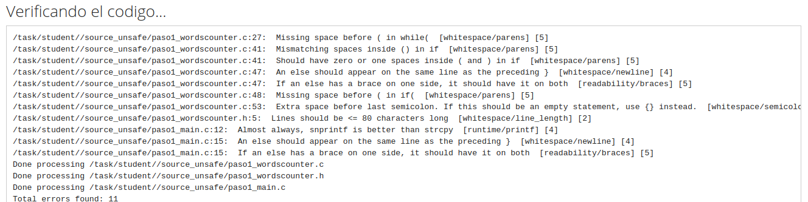

En orden:

* Missing space: no se deja espacio entre el while y el paréntesis (se debe colocar un espacio entre la cláusula de flujo y la condición entre paréntesis).
* Missmatching spaces: el error parece indicar que no hay consistencia en el uso de espacios. Pero el error según la documentación es que se colocaron espacios innecesarios dentro de los paréntesis.
* Should have zero or one spaces: no se deben colocar espacios innecesarios dentro de los paréntesis.
* An else should appear on the same line: el "else if" debería ir en la línea de arriba, para evitar líneas en blanco de código.
* If an else: por una parte, repite el error de arriba: si se tiene un else, debería aparecer en la línea donde se cierra el if. Por lo tanto, si se utilizaron corchetes para el if, entonces el else también debería usarlos y necesariamente tendrá a la izquierda el del cierre del if y a la derecha el del comienzo del else. Mezcla el error de arriba con la consistencia en el uso o no de corchetes en un mismo bloque.
* Missing space: lo mismo que el primer error.
* Extra space: se deja un espacio innecesario antes del ";" de esa línea.
* Lines should be: se superó la longitud máxima indicada para una línea (80 caracteres)
* Snprintf is better: se advierte contra el uso de printf y funciones derivadas en la sección de streams de la guía de cpplint, por motivos varios.
* An else should appear on the same line: lo mismo que en la anterior aparición de este error.
* If an else: lo mismo que en la anterior aparición de este error.

**b)**

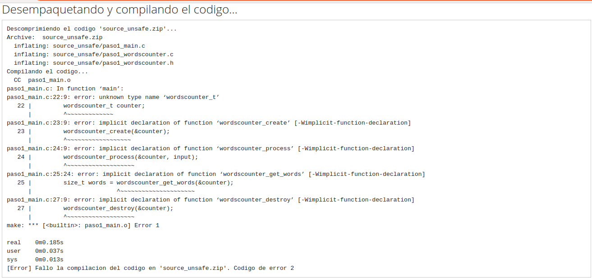

En orden:

* unknown type name: no reconoce el tipo de la variable declarada;
* implicit declaration of function: se está utilizando una función cuya firma no se conoce, porque no se declaró (en el entorno correcto). Aplica para todas las instancias de este error.

Son todos errores de compilación. Tanto la estructura de datos wordscounter_t como las funciones se encuentran declaradas en el archivo paso1_wordscounter.h y definidas en el archivo paso1_wordscounter.c (aunque la función destroy no está definida, en realidad). Pero el problema principal es que, al no incluirse en main el archivo .h, a través de la línea #include "paso1_wordscounter.h", el compilador no tiene forma de saber que ese tipo de datos y esas funciones están definidas en otro archivo.

**c)**

El sistema no reporta warnings porque, en el Makefile, se utilizó la opción -Werror para compilar, lo que convierte a todas las advertencias o warnings en errores.

### Paso 2

**a)**

En el main del paso 2:

* Se hace el include del wordcounter.h, lo que debería resolver los problemas de compilación relacionados a la falta de este include.
* Se reemplaza strcpy por memcpy.
* Se corrigen errores de estilo.

En el wordcounter.c del paso 2:

* Se corrigen errores de estilo.

En el wordcounter.h del paso 2:

* Se achica la línea que superaba los 80 caracteres.

**b)**

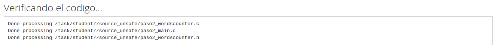

**c)**

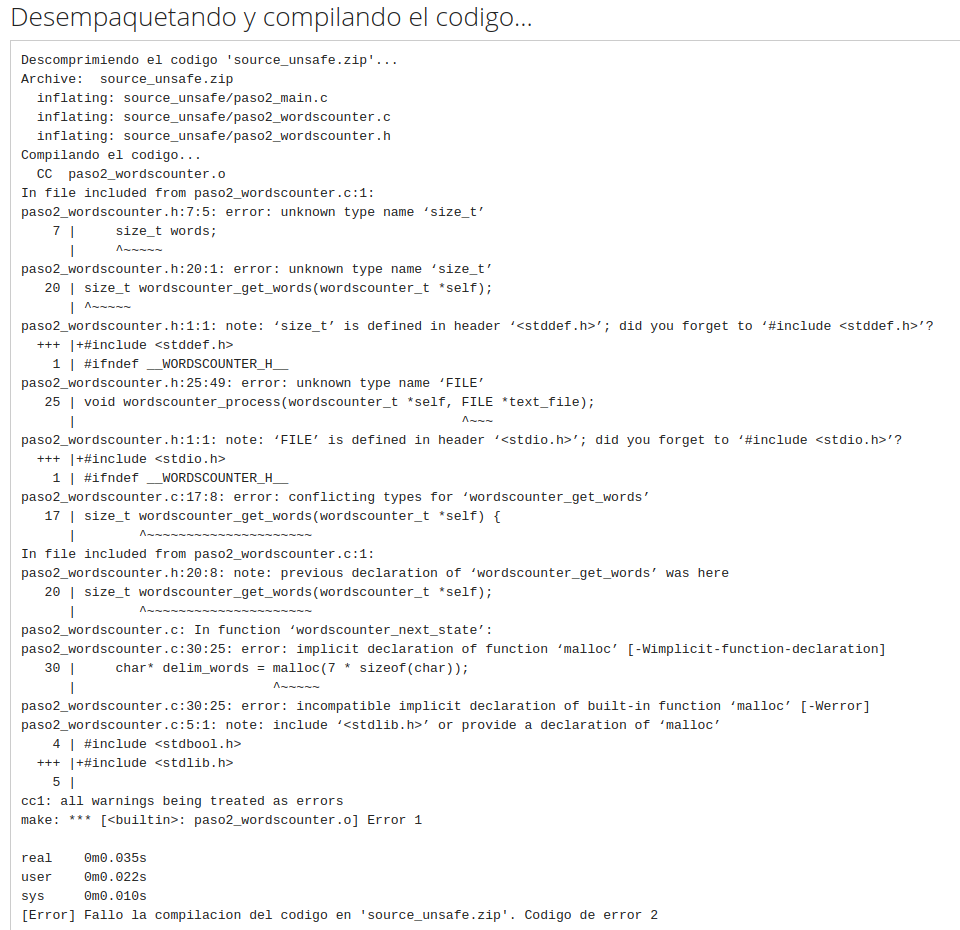

En orden:

* unknown type size_t: en el standard C99, no estaba incluido size_t como tipo de dato primitivo. Es necesario incluir stddef.h en el código (lo dice el mismo compilador).
* unknown type FILE: análogo al error de arriba. En este caso, habría que incluir stdio.h.
* conflicting types: no entiendo del todo este error, porque el método está definido con la misma firma en el .h y en el .c, lo que sería correcto. Como se devuelve un size_t, que no es reconocido como tipo de dato, asumo que el error proviene de ahí.
* implicit declaration of function malloc: sucede algo similar a lo que pasa con size_t y FILE. En este caso, malloc es una función definida en stdlib.h, por lo que es necesario incluir esa librería para poder usar la función.

Al igual que en el paso anterior, todos son errores de compilación.

### Paso 3

**a)**

Básicamente, se incluyen las librerías que faltaban en la versión anterior.

**b)**

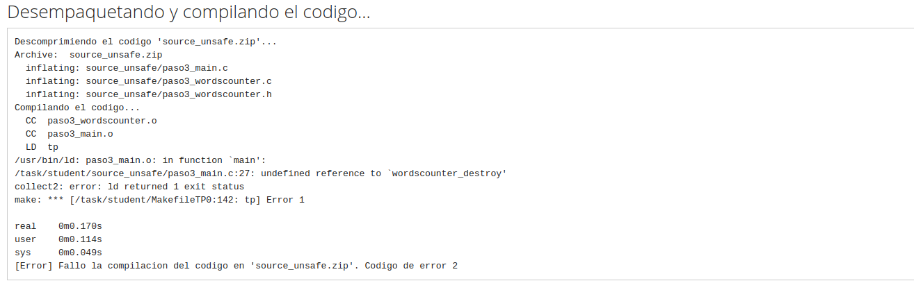

El único error de compilación, undefined reference, se da porque la función wordscounter_destroy, si bien está declarada en el .h, no está definida en el .c. El error es de compilación.

### Paso 4

**a)**

La diferencia principalmente es que se incluyó en wordscounter.c la definición de la función destroy, aunque se dejó su funcionamiento vacío.

**b)**

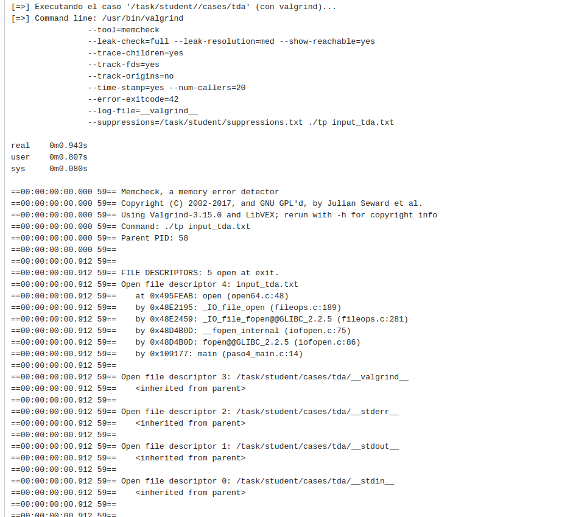

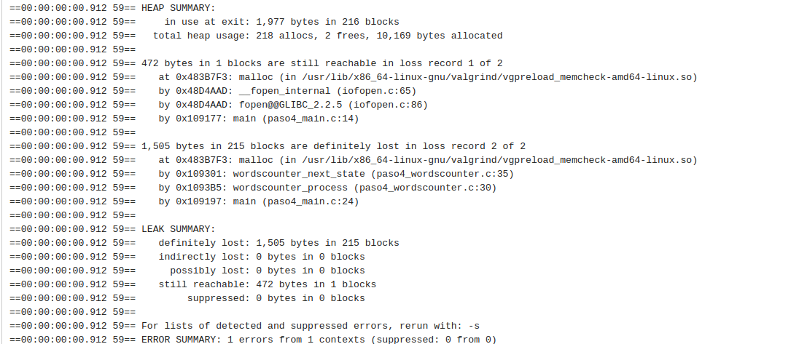

Según Valgrind, se allocaron 218 bloques de memoria dinámica. Sólo se realizaron 2 frees.

De los 216 bloques no liberados, 1 de esos bloques estaba siendo correctamente rastreado por el programa (se tenía su dirección de memoria), por lo que se lo categoriza como "still reachable". Este bloque tenía un tamaño de 472 bytes.

Los otros 215 bloques se categorizan como "definitely lost", porque el programa en algún momento perdió el acceso a su dirección de memoria. El tamaño total de los 215 bloques era de 1505 bytes.

**c)**

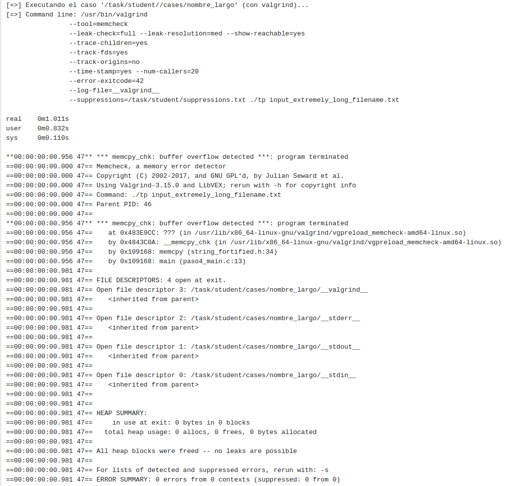

En este caso, no hay errores de pérdida de memoria del heap. Lo que sí sucede es que, durante el uso de memcpy en main.c, se excede la capacidad del buffer, que vive en el stack, utilizado en la función. Es decir, la cantidad de bytes que se intentaron copiar al buffer de la función excedieron su longitud, que era de 30 bytes.

**d)**

En este caso, utilizar strncpy no hubiera servido de nada. La diferencia principal entre ambas funciones es que memcpy copiará la cantidad de bytes determinada por el tercer argumento que se le pasa (en este caso, 34 bytes). Por su parte, strncpy copiará como máximo la cantidad de bytes indicada por parámetro, pero si antes de esa determinada posición encuentra un "\0", copiará hasta la posición del "\0". Por lo tanto, en este caso, strncpy también se hubiera excedido de la capacidad del buffer, porque el "\0" se encontraba en la posición 34 de la cadena.

**e)**

Buffer overflow: como se explicó arriba se da cuando, dado un determinado buffer o arreglo en memoria estática, se intenta ingresar copiar al buffer información que termina excediendo el tamaño del buffer, y termina sobreescribiendo o intentando sobreescribir posiciones de memoria que están por fuera del buffer.

Segmentation fault: es un error relacionado a la protección de memoria de la computadora. Todos los procesos en ejecución tienen un espacio de direcciones, fuera del cual no pueden acceder. Cuando un proceso intenta acceder a una posición de memoria que cae fuera de su espacio de direcciones, se levanta un segmentation fault. Esa dirección de memoria no pertenece a ese proceso, y por lo tanto no tiene acceso a la misma.

### Paso 5

**a)**

* Se utilizó directamente el elemento 1 de argv como argumento de la función fopen, en lugar de copiar su contenido a un buffer. Se agregó también una condición que verificara si el input venía de un archivo o no. En caso de venir de un archivo, se cierra el archivo al finalizar.

* Se cambió la forma de definir los posibles caracteres delimitadores. Antes se los agregaba uno por uno a un arreglo, ahora se generó un string a partir de un puntero a char, en el que se incluyeron todos los posibles delimitadores.

**b)**

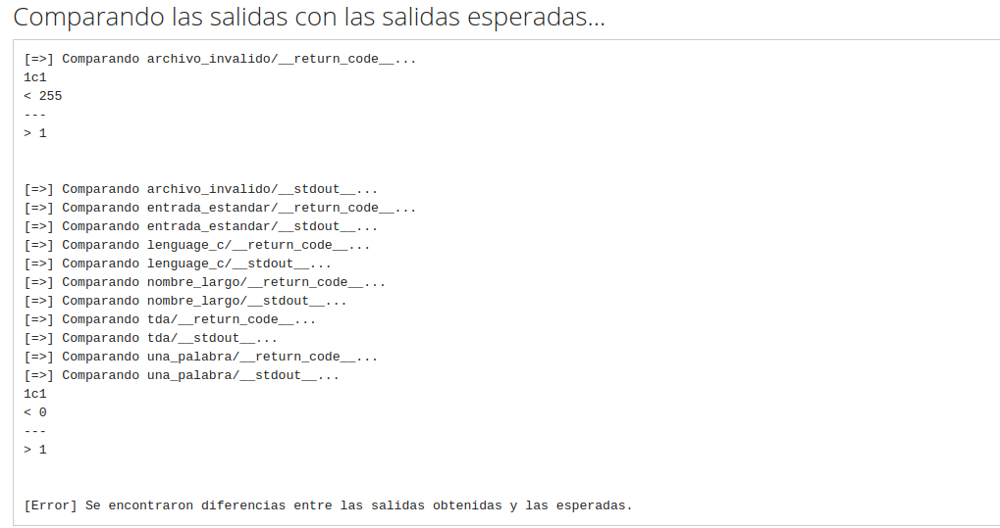

Las funciones fallan porque el output que devuelven no es el esperado, o sea, el resultado de la función no es el que debería ser. En invalid_file se espera como resultado un 255 y se devuelve un 1, y en single_name se espera un 0 y se devuelve también un 1.

**c)**

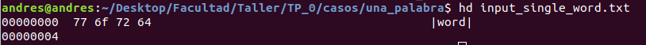

Es bastante difícil leer el resultado de hexdump, pero el último caracter de acuerdo a lo obtenido es una "d". Además, el EOF no se indica a través de un caracter, así que no tendría sentido que fuera otro el último caracter.

**d)**

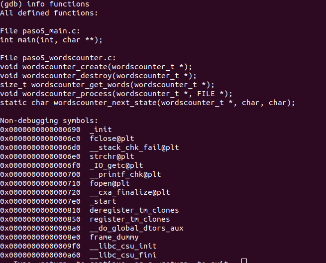

**info funcions**: muestra la lista de funciones del programa que se está debuggeando.

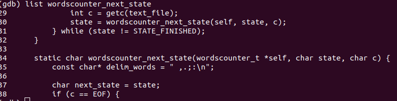

**list [función]**: imprime 10 líneas del programa centradas alrededor del inicio de la función.

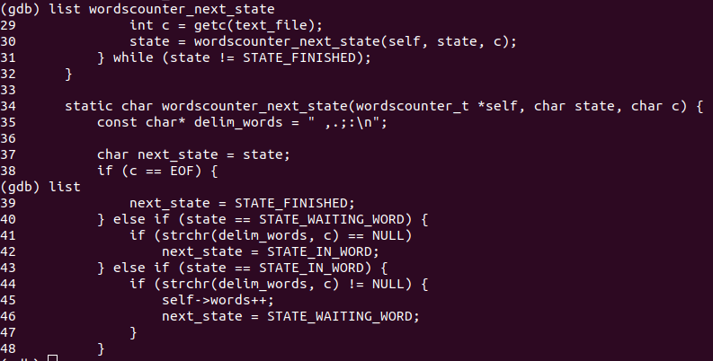

**list**: imprime las 10 próximas líneas del programa a partir de la cual se está ejecutando.

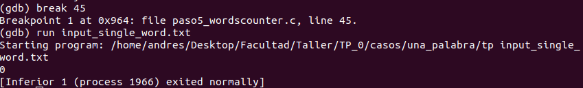

**break [num de línea]**: pone un breakpoint en la línea indicada.

**run [argumento]**: ejecuta el programa con el argumento especificado.

El debugger se saltea el breakpoint de la línea 45 porque el programa no entra al if en el que está contenida la línea.

